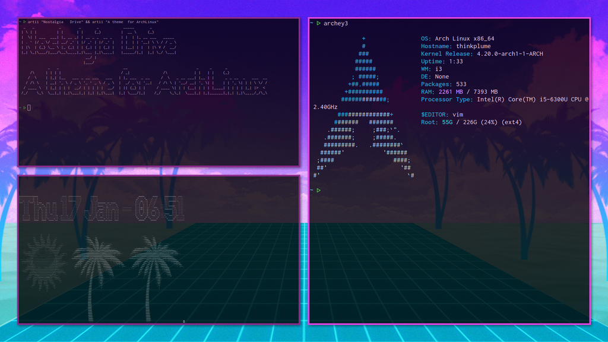

# Portfolio

## I Got Paid For This

### Entreprise.data.gouv.fr

[Link](https://entreprise.data.gouv.fr/)

- The Open Data reference for all French Companies ans Associations.
- Rails Backend + Vue.js Frontend + Solr as a search engine + Ansible for the servers.
- Design by Thimy from [Codeurs en Liberté](https://www.xn--codeursenlibert-pnb.fr/)

## I Got No Money But I Had Fun

### Is that a banana ?

[Link](http://www.isthatabanana.com/)

- Fun weekend project using Vue.js and TensorFlow.js
- Analyze pics of bananas with a client-side neural network.

### ArchLinux Theme : Nostalgia Drive

[Link](https://github.com/Samuelfaure/dotfiles_nostalgia_drive)

- Dotfiles for my ArchLinux config ricing.
- Hand-picked color palette on a vaporwave theme.

## What About School ?

Many graphical projects in pure C, including a Wolf3D clone and a feature-rich Raytracer.

## Contact Me

[samuel.faure.dev@gmail.com](mailto:samuel.faure.dev@gmail.com)