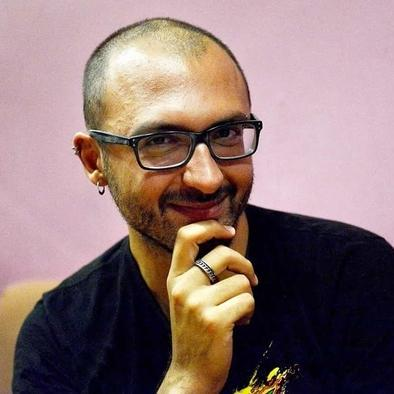

# Samuel Faure, Fullstack developer.

## Skills

Knows **Backend**, **Frontend**, **Devops**.

Languages include: **English**, **French**, **Javascript**, **Ruby**, **C**.

Frameworks: **Rails**, **Vue.js**.

## Degrees

Outstanding results at coding school **42 Paris**.

Also, an engineering degree in **Food Science**. Just for fun.

## Experience

1 to 2 years of :

- Coding **Clean**, **Agile**, and **Test-driven**.
- Mentoring WebDev students at [OpenClassrooms](https://openclassrooms.com/).

## Portfolio

### For the French Governement

[Entreprise.data.gouv.fr](https://entreprise.data.gouv.fr/)

- Did almost everything: Backend, frontend, deployment and maintenance.
- Rails Backend + Vue.js Frontend + Solr as a search engine.

### As a Hobby

[Is that a banana ?](http://www.isthatabanana.com/)

- Fun weekend project using Vue.js and TensorFlow.js
- Analyze pics of bananas with a client-side neural network.

### For School

A ton of C projects, including a RayTracer with powerful features, a GTK+ interface, global illumination, and much more.

## Contact Me

[samuel.faure.dev@gmail.com](mailto:samuel.faure.dev@gmail.com)